# Servidor de correos en los servidores cloud

Vamos a realizar un sistema de correo para el dominio `tudominio.gonzalonazareno.org`, cuyo servidor DNS lo administras en tu propio servidor DNS. Tienes que comunicar el nombre de dominio al profesor para configurar el servidor de correos del departamento. Instala postfix y comprueba que recibe correo directamente desde un equipo de Internet (hotmail, gmail, etc.). Configura tu servidor de correos para que use a `babuino-smtp` como relay y comprueba que puedes enviar correos.

## Tarea 1
**Documenta una prueba de funcionamiento, donde envíes desde tu servidor local al exterior. Muestra el log donde se vea el envío. Muestra el correo que has recibido.**

Vamos a instalar el servidor de correos postfix
~~~
sudo apt install postfix

 ┌──────────────────────┤ Postfix Configuration ├──────────────────────┐
 │ Please select the mail server configuration type that best meets    │ 
 │ your needs.                                                         │ 
 │                                                                     │ 
 │  No configuration:                                                  │ 
 │   Should be chosen to leave the current configuration unchanged.    │ 
 │  Internet site:                                                     │ 
 │   Mail is sent and received directly using SMTP.                    │ 
 │  Internet with smarthost:                                           │ 
 │   Mail is received directly using SMTP or by running a utility      │ 
 │ such                                                                │ 
 │   as fetchmail. Outgoing mail is sent using a smarthost.            │ 
 │  Satellite system:                                                  │ 
 │   All mail is sent to another machine, called a 'smarthost', for    │ 
 │ delivery.                                                           │ 
 │  Local only:                                                        │ 
 │   The only delivered mail is the mail for local users. There is no  │ 
 │ network.                                                            │ 
 │                                                                     │ 
 │ General type of mail configuration:                                 │ 
 │                                                                     │ 
 │                      No configuration                               │ 
 │               --->   Internet Site                                  │ 
 │                      Internet with smarthost                        │ 
 │                      Satellite system                               │ 
 │                      Local only                                     │ 
 │                                                                     │ 
 │                                                                     │ 
 │                  <Ok>                      <Cancel>                 │ 
 │                                                                     │ 
 └─────────────────────────────────────────────────────────────────────┘ 
 ┌──────────────────────┤ Postfix Configuration ├──────────────────────┐
 │ The "mail name" is the domain name used to "qualify" ALL mail       │ 
 │ addresses without a domain name. This includes mail to and from     │ 
 │ <root>: please do not make your machine send out mail from          │ 
 │ root@example.org unless root@example.org has told you to.           │ 
 │                                                                     │ 
 │ This name will also be used by other programs. It should be the     │ 
 │ single, fully qualified domain name (FQDN).                         │ 
 │                                                                     │ 
 │ Thus, if a mail address on the local host is foo@example.org, the   │ 
 │ correct value for this option would be example.org.                 │ 
 │                                                                     │ 
 │ System mail name:                                                   │ 
 │                                                                     │ 
 │ croqueta.amorales.gonzalonazareno.org                               │ 
 │                                                                     │ 
 │                  <Ok>                      <Cancel>                 │ 
 │                                                                     │ 
 └─────────────────────────────────────────────────────────────────────┘ 
~~~

Vamos a editar en el fichero `/etc/postfix/main.cf` las siguientes lineas:
~~~
myhostname = amorales.gonzalonazareno.org
relayhost = babuino-smtp.gonzalonazareno.org
~~~

Como vemos, le hemos indicado que `muhostname` es nuestro dominio y el `relayhost` es babuino, que es por el cual va a pasar todos nuestros correos.

Editamos el fichero `/etc/mailname` y ponemos el nombre del correo que queremos utilizar.
~~~
amorales.gonzalonazareno.org
~~~

>**NOTA**: He comprobado que aún cambiando el nombre en el fichero `/etc/mailname` el nombre que se muestra es el del hostname por un error de postfix.

Vamos a reinicar el servicio de postfix
~~~
sudo systemctl restart postfix.service
~~~

Ahora vamos a enviar un correo con `mail` segudo de la dirección de correo que queramos enviar.
~~~
mail ale95mogra@gmail.com
    Cc: 
    Subject: Correo de prueba

    Prueba de correo para Alejandro Morales
    Github: https://github.com/MoralG
    Web: https://www.alejandro-mg.com/
    Linkedin: https://www.linkedin.com/in/alejandro-morales-gracia/
~~~

Primero nos sale la opción `Cc` que es para el reenvio el cual lo podemos dejar en blanco, luego le indicamos el concepto en `Subject` y por último el mensaje, cuando queramos terminar y enviar, tenemos que hacer <CTRL+D>.

Y comprobamos que nos ha llegado:

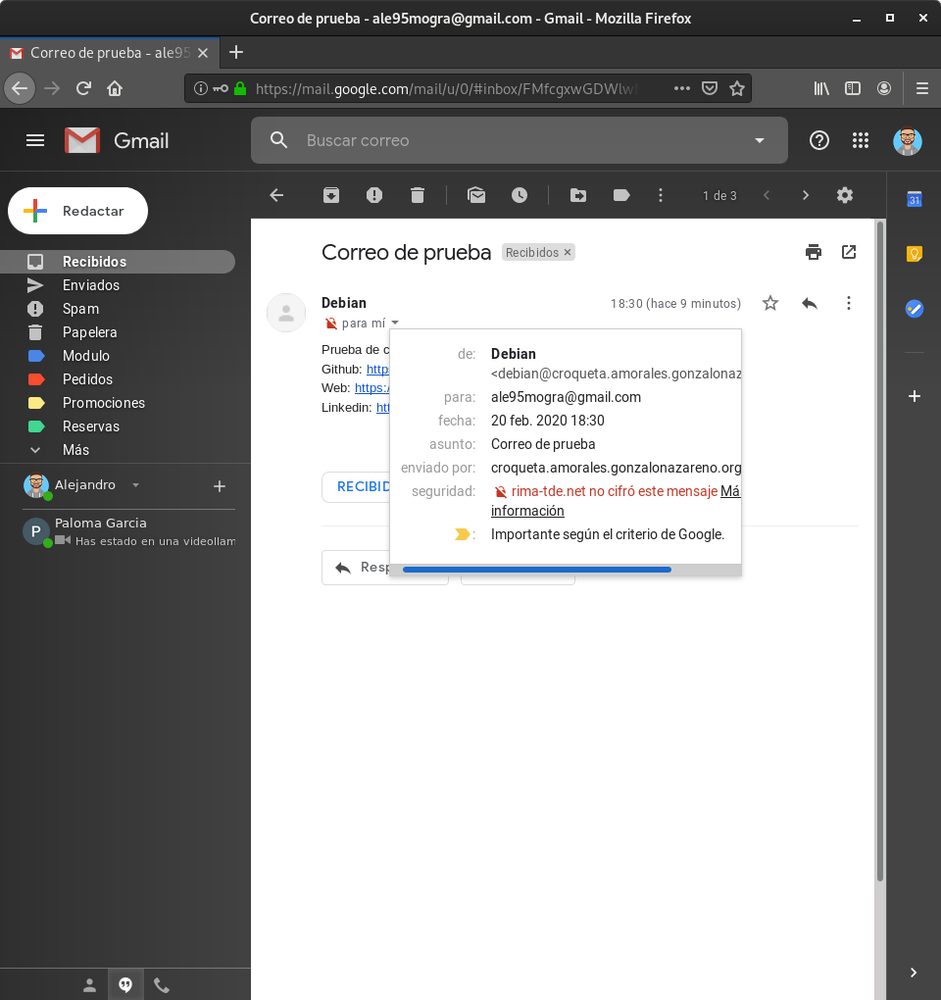


Comprobamos los log en `/var/log/syslog`
~~~
sudo tail /var/log/syslog
    Feb 20 17:26:55 croqueta postfix/postfix-script[28303]: starting the Postfix mail system
    Feb 20 17:26:55 croqueta postfix/master[28305]: daemon started -- version 3.4.8, configuration /etc/postfix
    Feb 20 17:26:55 croqueta systemd[1]: Started Postfix Mail Transport Agent (instance -).
    Feb 20 17:26:55 croqueta systemd[1]: Starting Postfix Mail Transport Agent...
    Feb 20 17:26:55 croqueta systemd[1]: Started Postfix Mail Transport Agent.
    Feb 20 17:30:16 croqueta postfix/pickup[28307]: E594841F74: uid=1000 from=<debian@croqueta.amorales.gonzalonazareno.org>
    Feb 20 17:30:16 croqueta postfix/cleanup[28345]: E594841F74: message-id=<20200220173016.E594841F74@croqueta.amorales.gonzalonazareno.org>
    Feb 20 17:30:16 croqueta postfix/qmgr[28308]: E594841F74: from=<debian@croqueta.amorales.gonzalonazareno.org>, size=588, nrcpt=1 (queue active)
    Feb 20 17:30:17 croqueta postfix/smtp[28347]: E594841F74: to=<ale95mogra@gmail.com>, relay=babuino-smtp.gonzalonazareno.org[192.168.203.3]:25, delay=0.11, delays=0.05/0.03/0.01/0.02, dsn=2.0.0, status=sent (250 2.0.0 Ok: queued as A83911BBFF)
~~~

## Tarea 2
**Documenta una prueba de funcionamiento, donde envíes un correo desde el exterior (gmail, hotmail,…) a tu servidor local. Muestra el log donde se vea el envío. Muestra cómo has leído el correo.**

Realizaremos la prueba a la inversa, enviaremos un correo desde ale95mogra@gmail.com.

Primero vamos a añadir un registro al dns para poder recibir el correo desde fuera.

~~~
@               IN      MX   10 croqueta
~~~

Reiniciamos el dominio para que se actualice las modificaciones.
~~~
sudo rndc reload
    server reload successful
~~~

Enviamos el correo desde Gmail.

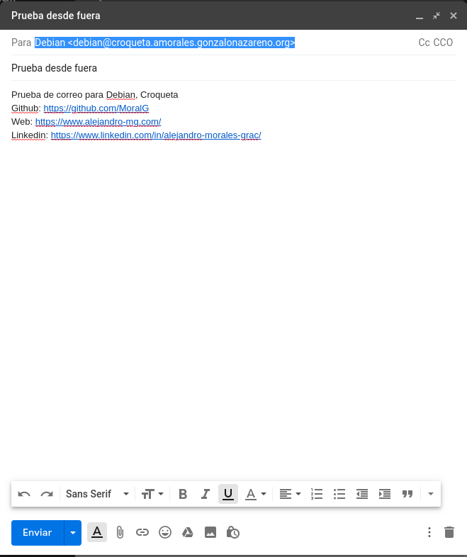

Vamos a ver si hemos recibido el correo con el comando `mail` y luego le indicamos el correo que queremos que nos muestre.

~~~
mail
    "/var/mail/debian": 1 message 1 new
    >N   1 Alejandro Morales  Thu Feb 20 17:47  65/3685  Prueba desde fuera

    ? 1
    .
    .
    .
    From: Alejandro Morales Gracia <ale95mogra@gmail.com>
    Date: Thu, 20 Feb 2020 18:47:46 +0100
    Message-ID: <CANRnTqxtwRzjxEb2LDiyURjXTgwZ=bCCk1yP+HXRzniYJd4akA@mail.gmail.com>
    Subject: Prueba desde fuera
    To: Debian <debian@croqueta.amorales.gonzalonazareno.org>
    Content-Type: multipart/alternative; boundary="00000000000056ea38059f058177"

    --00000000000056ea38059f058177
    Content-Type: text/plain; charset="UTF-8"

    Prueba de correo para Debian, Croqueta
    Github: https://github.com/MoralG
~~~

Comprobamos los log
~~~
sudo tail /var/log/syslog
    Feb 20 17:30:16 croqueta postfix/qmgr[28308]: E594841F74: from=<debian@croqueta.amorales.gonzalonazareno.org>, size=588, nrcpt=1 (queue active)
    Feb 20 17:30:17 croqueta postfix/smtp[28347]: E594841F74: to=<ale95mogra@gmail.com>, relay=babuino-smtp.gonzalonazareno.org[192.168.203.3]:25, delay=0.11, delays=0.05/0.03/0.01/0.02, dsn=2.0.0, status=sent (250 2.0.0 Ok: queued as A83911BBFF)
    Feb 20 17:30:17 croqueta postfix/qmgr[28308]: E594841F74: removed
    Feb 20 17:47:39 croqueta postfix/smtpd[28531]: connect from babuino-smtp.gonzalonazareno.org[192.168.203.3]
    Feb 20 17:47:39 croqueta postfix/smtpd[28531]: C6D3741F73: client=babuino-smtp.gonzalonazareno.org[192.168.203.3]
    Feb 20 17:47:39 croqueta postfix/cleanup[28537]: C6D3741F73: message-id=<CANRnTqxtwRzjxEb2LDiyURjXTgwZ=bCCk1yP+HXRzniYJd4akA@mail.gmail.com>
    Feb 20 17:47:39 croqueta postfix/qmgr[28308]: C6D3741F73: from=<ale95mogra@gmail.com>, size=3592, nrcpt=1 (queue active)
    Feb 20 17:47:39 croqueta postfix/smtpd[28531]: disconnect from babuino-smtp.gonzalonazareno.org[192.168.203.3] ehlo=1 mail=1 rcpt=1 data=1 quit=1 commands=5
    Feb 20 17:47:39 croqueta postfix/local[28538]: C6D3741F73: to=<debian@croqueta.amorales.gonzalonazareno.org>, relay=local, delay=0.06, delays=0.03/0.01/0/0.01, dsn=2.0.0, status=sent (delivered to mailbox)
    Feb 20 17:47:39 croqueta postfix/qmgr[28308]: C6D3741F73: removed
~~~

-----------------------------------------------
Instala y configura un servidor dovecot POP e IMAP en tu equipo. Configura adecuadamente un cliente de correo (evolution, outlook, thunderbird, …) para que reciba el correo a través de POP o IMAP. El cliente debe estar configurado en una máquina cliente. Nombra en tu servidor DNS al servidor smtp, pop e imap.

## Tarea 3
**Documenta una prueba de funcionamiento, donde envíes desde tu cliente de correos al exterior. ¿Cómo se llama el servidor para enviar el correo? (Muestra la configuración).**

### Servidor

Tenemos que instalar los paquetes necesarios para tener POP e IMAP.
~~~
sudo apt install dovecot-imapd dovecot-pop3d dovecot-core
~~~

Añadimos al fichero de configuración `/etc/postfix/main.cf` de nuestro servidor de correos las siguientes lineas:
~~~
mynetworks = 127.0.0.0/8 [::ffff:127.0.0.0]/104 [::1]/128 10.0.0.0/24 172.22.0.0/16
home_mailbox = Maildir/
mailbox_command =
~~~

En `mynetworks` tenemos que añadir las direcciones de nuestros clientes que vamos a permitir.
En `home_mailbox`
En `mailbox_command`

También tenemos que modificar el fichero `etc/dovecot/conf.d/10-auth.conf` 
~~~
disable_plaintext_auth = no 
~~~

El parametro `disable_plaintext_auth` lo descomentamos y le cambiamos el valor a `no`.

Ahora vamos a modificar el fichero `/etc/dovecot/conf.d/10-mail.conf`.
~~~
mail_location = maildir:~/Maildir
~~~

Reiniciamos el servicio de postfix para que se actualice las modificaciones.
~~~
sudo systemctl restart postfix.service
sudo systemctl restart dovecot.service 
~~~

En el parámatro `mail_location` tenemos que indicarle `maildir:~/Maildir`.

Añadimos al dns los siguientes registro:
~~~
pop             IN      CNAME   croqueta
imap            IN      CNAME   croqueta
~~~

Reiniciamos el dominio para que se actualice las modificaciones.
~~~
sudo rndc reload
    server reload successful
~~~

Tenemos que abrir los puertos POP e IMAP en Openstack. 

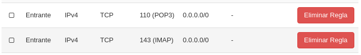

### Cliente
Ahora tenemos crearnos una cuenta en el cliente de correo, en mi caso vamos a utilizar Evolution que es el que viene por defecto en Debian.

Hacemos clic en **Archivo** > **Nuevo** > **Cuenta de correo** y nos saldrá para introducir nuestra identidad.

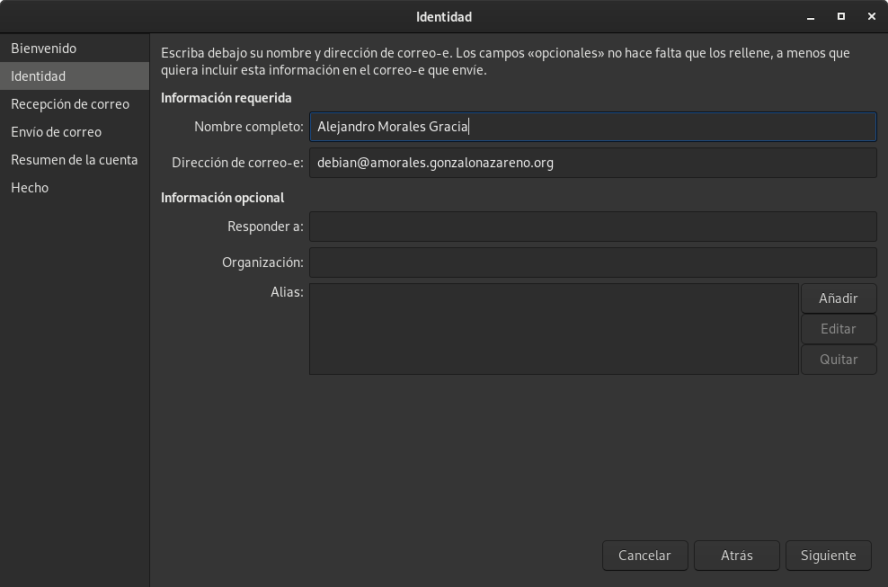

Indicamos el protocolo por el cual vamos a recibir los correos. Vamos a utilizar POP y le indicamos el nombre del servidor, el cual es el indicado en el DNS.

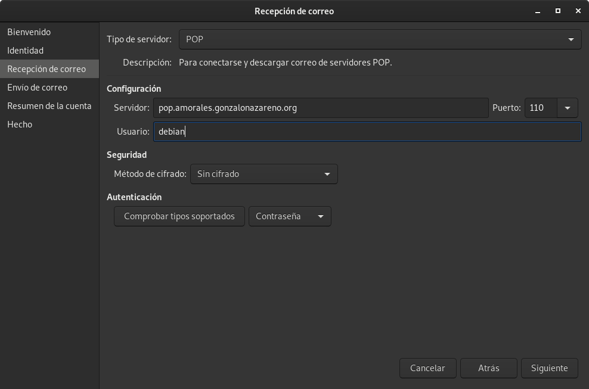

Ahora indicamos el método de envio de correo, el cual va a ser SMTP, y configuramos el servidor como nuestro dominio de correos.

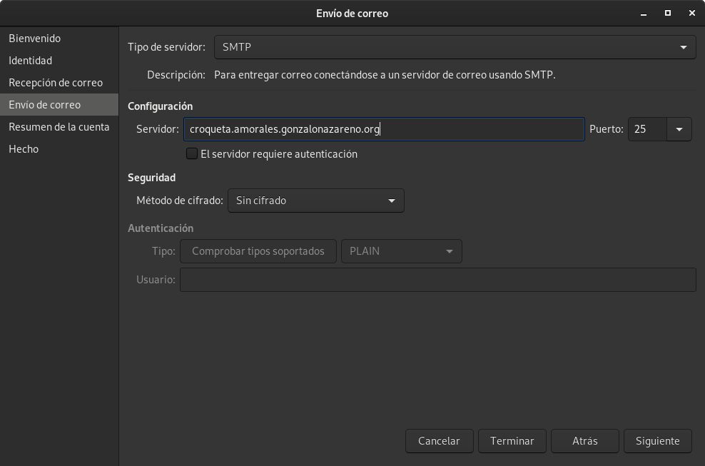

Podemos ver como sería la configuración de la cuenta.

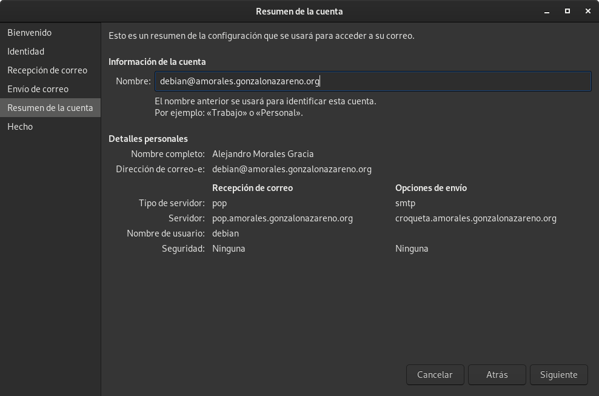

Realizamos la prueba enviando un correo desde nuestro cliente Evolution a una cuenta de Gmail.

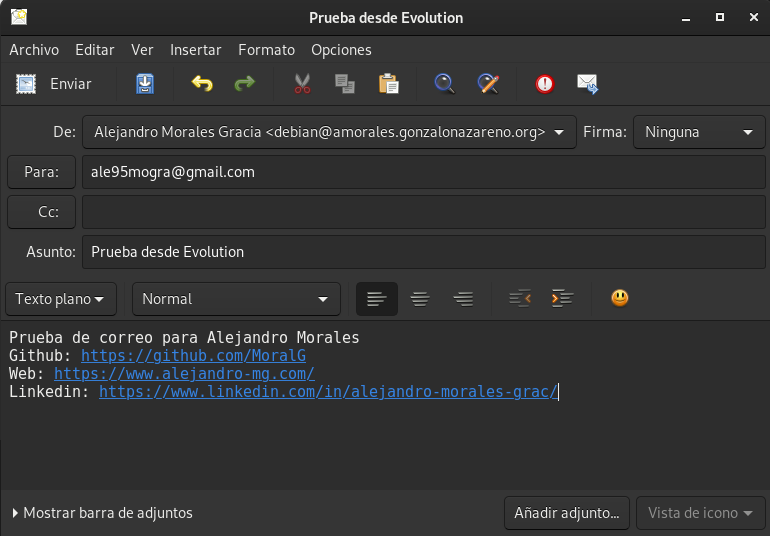

Como podemos ver, hemos recibido el correo.

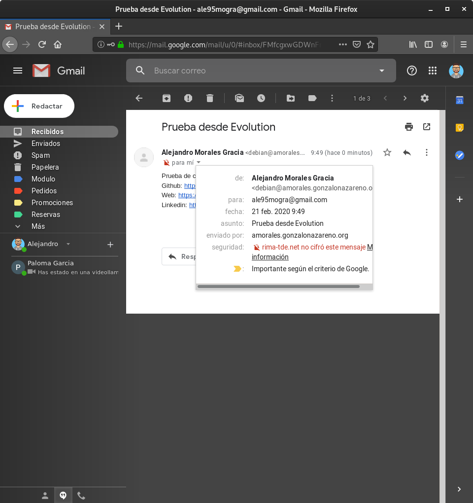


## Tarea 4
**Documenta una prueba de funcionamiento, donde recibas un correo desde el exterior (gmail, hotmail,…) y lo leas en tu cliente de correo. Utiliza el protocolo POP. ¿Cómo se llama el servidor para enviar el correo? (Muestra la configuración). Muestra una prueba de funcionamiento de cómo funciona el protocolo POP.**

Antes de poder recibir conrreos tenemos que autentificarnos con un usuario y una contraseña. Para realizar esto tenemos que asignarle una contraseña al usuario debian del servidor Croqueta.

~~~
sudo passwd debian
    New password: 
    Retype new password: 
    passwd: password updated successfully
~~~

Ahora hacemos clic en **Enviar / Recibir** y nos pedirá que ingresemos usuario y contraseña.

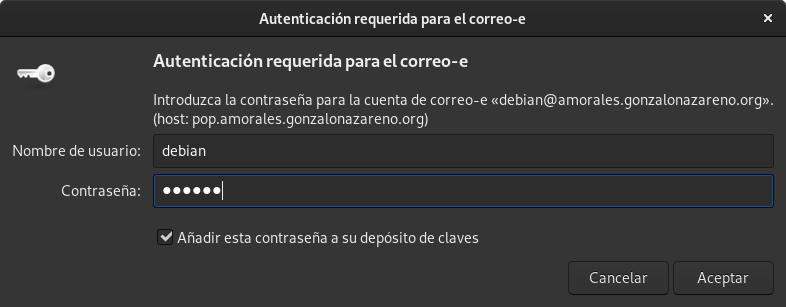

Enviamos un correo desde Gmail para debian@amorales.gonzalonazareno.org


Nos lo descargamos del servidor a nuuestro cliente Evolution.

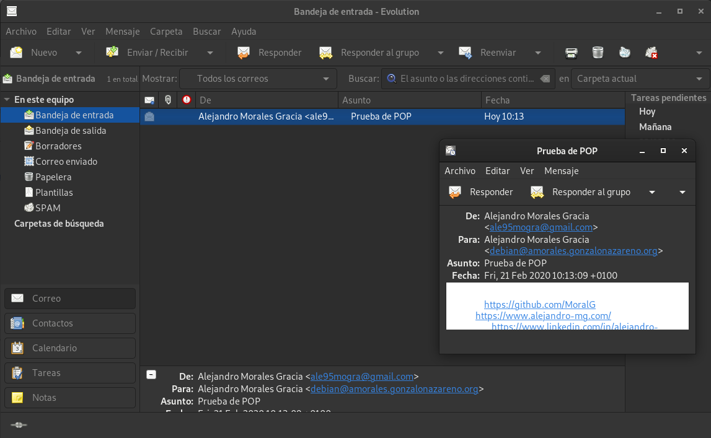


El protocolo POP deja los mensajes recibidos en el Servidor pero cuando nos lo descargamos en nuestro cliente Evolution, desaparecen del Servidor.
~~~
debian@croqueta:~$ ls -l Maildir/cur/
total 0
debian@croqueta:~$ ls -l Maildir/new/
total 0
~~~

## Tarea 5
**Documenta una prueba de funcionamiento, donde recibas un correo desde el exterior (gmail, hotmail,…) y lo leas en tu cliente de correo. Utiliza el protocolo IMAP. ¿Cómo se llama el servidor para enviar el correo? (Muestra la configuración). Muestra una prueba de funcionamiento de cómo funciona el protocolo IMAP.**

Para configurar el cliente para que utilice el protocolo IMAP tenemos que añadir una nueva cuenta pero en vez de utilizar POP configuramos IMAP

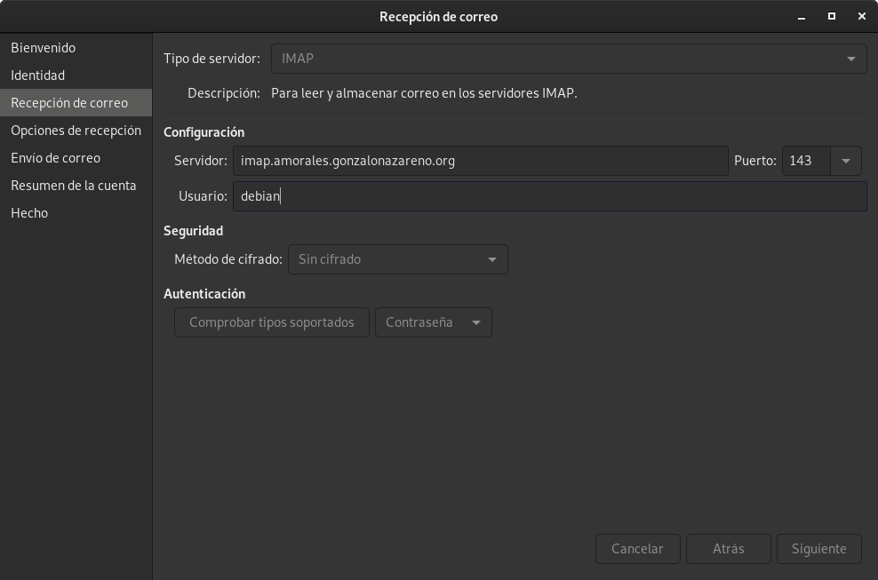

Para realizar la comprobamación vamos a enviar un correo desde el exterior.

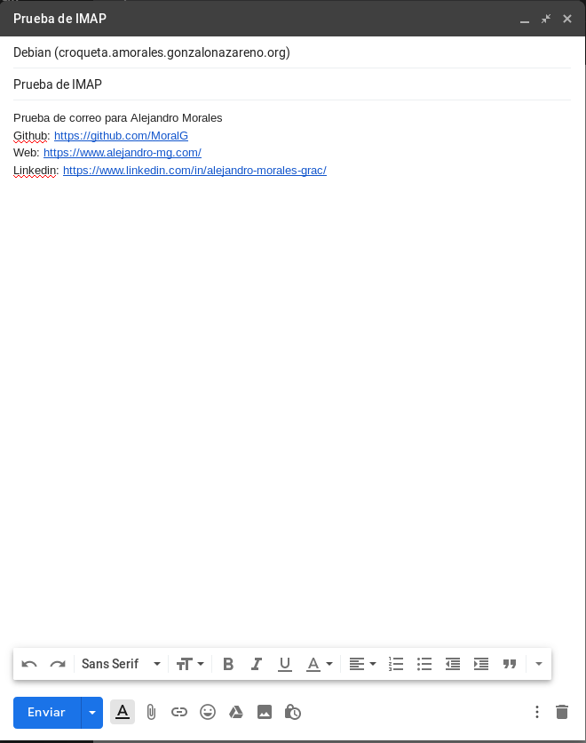

Comprobamos que nos llega al servidor en el directorio `Maildir/new/`.
~~~
debian@croqueta:~$ ls -l Maildir/new/
total 4
-rw------- 1 debian debian 3585 Feb 21 10:11 1582279916.Vfe01I43592M497389.croqueta

debian@croqueta:~$ ls -l Maildir/cur/
total 0
~~~

Nos lo descargamos en el cliente Evolution.

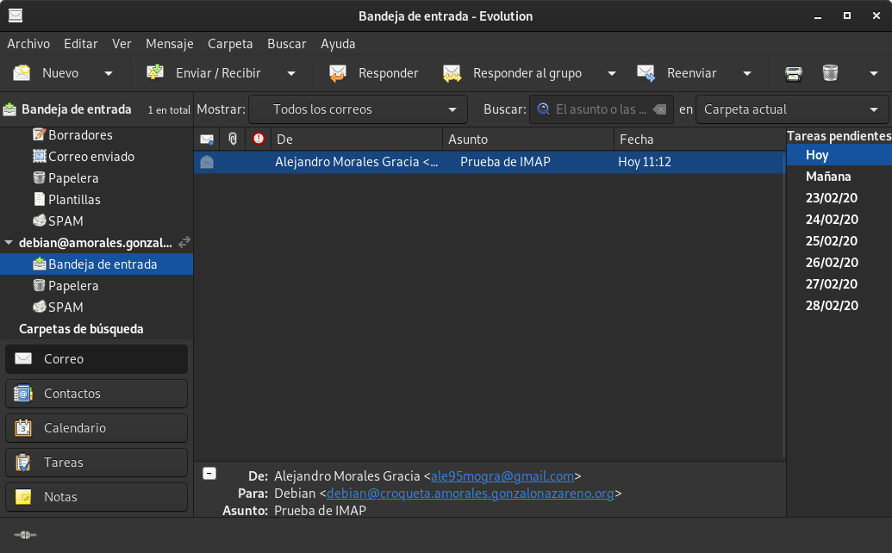


Y al ser el protocolo IMAP, se nos pasará al directorio `Maildir/cur/` y también lo tendremos en el cliente Evolution.
~~~
debian@croqueta:~$ ls -l Maildir/new/
total 0

debian@croqueta:~$ ls -l Maildir/cur/
total 4
-rw------- 1 debian debian 3585 Feb 21 10:11 1582279916.Vfe01I43592M497389.croqueta:2,S
~~~

--------------------------------------------

---------------------------------------------------

## Tarea 6
**Configura el cron para enviar correo al usuario root. Comprueba que están llegando esos correos al root. Crea un nuevo alias para que se manden a un usuario sin privilegios. Comprueban que llegan a ese usuario. Por último crea una redirección para enviar esos correo a tu correo de gmail.**

Vamos a comprobar como los procesos del servidor pueden mandar correos para informar sobre su estado. Por ejemplo cada vez que se ejecuta una tarea cron podemos enviar un correo informando del resultado. Normalmente estos correos se mandan al usuario root del servidor, para ello:

Vamos a añadir con el comando `crontab -e` el registro de cron.

~~~
MAILTO = root

* * * * * /root/MostrarProcesos.sh
~~~

Como vemos, hemos indicado que se lo envie al root cuando la tarea del cron se inicie, ejecutando el script.

El script va a mostrar los procesos que estan activos:

```bash
#! /bin/sh

ps aux
```

Reiniciamos el servicio de cron.
~~~
sudo systemctl restart cron.service 
~~~

Y comprobamos que nos ha llegado y lo tenemos en `/roo/Maildir/new`.
~~~
cat Maildir/new/1582283341.Vfe01I435a3M575605.croqueta
Return-Path: <root@amorales.gonzalonazareno.org>
X-Original-To: root
Delivered-To: root@amorales.gonzalonazareno.org
Received: by croqueta.amorales.gonzalonazareno.org (Postfix, from userid 0)
	id 89F87435A4; Fri, 21 Feb 2020 11:09:01 +0000 (UTC)
From: root@amorales.gonzalonazareno.org (Cron Daemon)
To: root@amorales.gonzalonazareno.org
Subject: Cron <root@croqueta> /root/MostrarProcesos.sh
MIME-Version: 1.0
Content-Type: text/plain; charset=UTF-8
Content-Transfer-Encoding: 8bit
X-Cron-Env: <MAILTO=root>
X-Cron-Env: <SHELL=/bin/sh>
X-Cron-Env: <HOME=/root>
X-Cron-Env: <PATH=/usr/bin:/bin>
X-Cron-Env: <LOGNAME=root>
Message-Id: <20200221110901.89F87435A4@croqueta.amorales.gonzalonazareno.org>
Date: Fri, 21 Feb 2020 11:09:01 +0000 (UTC)

USER       PID %CPU %MEM    VSZ   RSS TTY      STAT START   TIME COMMAND
root         1  0.0  1.5 105052  7464 ?        Ss    2019   0:46 /lib/systemd/systemd --system --deserialize 33
root         2  0.0  0.0      0     0 ?        S     2019   0:00 [kthreadd]
root         3  0.0  0.0      0     0 ?        I<    2019   0:00 [rcu_gp]
root         4  0.0  0.0      0     0 ?        I<    2019   0:00 [rcu_par_gp]
root         6  0.0  0.0      0     0 ?        I<    2019   0:00 [kworker/0:0H-kblockd]
root         8  0.0  0.0      0     0 ?        I<    2019   0:00 [mm_percpu_wq]
root         9  0.0  0.0      0     0 ?        S     2019   1:45 [ksoftirqd/0]
root        10  0.0  0.0      0     0 ?        I     2019   1:27 [rcu_sched]
root        11  0.0  0.0      0     0 ?        I     2019   0:00 [rcu_bh]
root        12  0.0  0.0      0     0 ?        S     2019   0:29 [migration/0]
root        14  0.0  0.0      0     0 ?        S     2019   0:00 [cpuhp/0]
root        15  0.0  0.0      0     0 ?        S     2019   0:00 [kdevtmpfs]
root        16  0.0  0.0      0     0 ?        I<    2019   0:00 [netns]
root        17  0.0  0.0      0     0 ?        S     2019   0:00 [kauditd]
root        18  0.0  0.0      0     0 ?        S     2019   0:02 [khungtaskd]
root        19  0.0  0.0      0     0 ?        S     2019   0:00 [oom_reaper]
root        20  0.0  0.0      0     0 ?        I<    2019   0:00 [writeback]
root        21  0.0  0.0      0     0 ?        S     2019   0:00 [kcompactd0]
root        22  0.0  0.0      0     0 ?        I<    2019   0:00 [crypto]
root        23  0.0  0.0      0     0 ?        I<    2019   0:00 [kintegrityd]
root        24  0.0  0.0      0     0 ?        I<    2019   0:00 [kblockd]
root        25  0.0  0.0      0     0 ?        S     2019   0:00 [watchdogd]
root        26  0.0  0.0      0     0 ?        S     2019   0:01 [kswapd0]
root        42  0.0  0.0      0     0 ?        I<    2019   0:00 [kthrotld]
root        43  0.0  0.0      0     0 ?        I<    2019   0:00 [ipv6_addrconf]
root        53  0.0  0.0      0     0 ?        I<    2019   0:00 [kstrp]
root       100  0.0  0.0      0     0 ?        I<    2019   0:00 [ata_sff]
root       103  0.0  0.0      0     0 ?        S     2019   0:00 [scsi_eh_0]
root       105  0.0  0.0      0     0 ?        I<    2019   0:00 [scsi_tmf_0]
root       106  0.0  0.0      0     0 ?        S     2019   0:00 [scsi_eh_1]
root       108  0.0  0.0      0     0 ?        I<    2019   0:00 [scsi_tmf_1]
root       159  0.0  0.0      0     0 ?        I<    2019   0:38 [kworker/0:1H-kblockd]
root       162  0.0  0.0      0     0 ?        I<    2019   0:00 [kworker/u3:0]
root       164  0.0  0.0      0     0 ?        S     2019   0:32 [jbd2/vda1-8]
root       165  0.0  0.0      0     0 ?        I<    2019   0:00 [ext4-rsv-conver]
root       257  0.0  0.6   8232  3184 ?        Ss    2019   0:56 /usr/sbin/haveged --Foreground --verbose=1 -w 1024
root       303  0.0  0.5   9488  2980 ?        Ss    2019   0:00 /sbin/dhclient -4 -v -i -pf /run/dhclient.eth0.pid -lf /var/lib/dhcp/dhclient.eth0.leases -I -df /var/lib/dhcp/dhclient6.eth0.leases eth0
root       332  0.0  0.6   9488  3164 ?        Ss    2019   0:00 /sbin/dhclient -4 -v -i -pf /run/dhclient.eth0.pid -lf /var/lib/dhcp/dhclient.eth0.leases -I -df /var/lib/dhcp/dhclient6.eth0.leases eth0
unscd      417  0.0  0.0   2516   136 ?        Ss    2019   0:24 /usr/sbin/nscd -d
message+   421  0.0  0.1   8852   740 ?        Ss    2019   0:03 /usr/bin/dbus-daemon --system --address=systemd: --nofork --nopidfile --systemd-activation --syslog-only
root       423  0.0  0.4  19408  2028 ?        Ss    2019   0:15 /lib/systemd/systemd-logind
root       428  0.0  0.0   5264    64 ttyS0    Ss+   2019   0:00 /sbin/agetty -o -p -- \u --keep-baud 115200,38400,9600 ttyS0 vt220
root       429  0.0  0.0   2564    68 tty1     Ss+   2019   0:00 /sbin/agetty -o -p -- \u --noclear tty1 linux
netdata   7815  0.7  1.0  14360  5356 ?        S    08:15   1:14 /usr/libexec/netdata/plugins.d/apps.plugin 1
root      7963  0.0  1.5  16604  7836 ?        Ss   08:28   0:00 sshd: debian [priv]
debian    7970  0.0  1.8  21152  9096 ?        Ss   08:28   0:00 /lib/systemd/systemd --user
debian    7971  0.0  0.5 106016  2636 ?        S    08:28   0:00 (sd-pam)
debian    7980  0.0  0.9  16604  4972 ?        S    08:28   0:00 sshd: debian@pts/0
debian    7982  0.0  1.0   8288  5224 pts/0    Ss   08:28   0:00 -bash
root      8986  0.0  0.7  43472  3976 ?        Ss   09:09   0:00 /usr/lib/postfix/sbin/master -w
postfix   8989  0.0  1.3  43456  6900 ?        S    09:09   0:00 qmgr -l -t unix -u
root      8990  0.0  0.0      0     0 ?        I    09:09   0:00 [kworker/u2:2-flush-254:0]
root      9077  0.0  0.6   4196  3124 ?        Ss   09:10   0:00 /usr/sbin/dovecot -F
dovecot   9081  0.0  0.2   3912  1008 ?        S    09:10   0:00 dovecot/anvil
root      9082  0.0  0.5   4048  2612 ?        S    09:10   0:00 dovecot/log
root      9083  0.0  0.7   5124  3768 ?        S    09:10   0:00 dovecot/config
dovecot   9103  0.0  0.5   4044  2752 ?        S    09:11   0:00 dovecot/stats
postfix   9184  0.0  1.4  43588  7012 ?        S    09:13   0:00 tlsmgr -l -t unix -u -c
netdata   9958  0.1  0.6   3784  3100 ?        S    10:21   0:03 bash /usr/libexec/netdata/plugins.d/tc-qos-helper.sh 1
postfix  10206  0.0  1.3  43404  6844 ?        S    10:49   0:00 pickup -l -t unix -u -c
root     10411  0.0  0.5   8356  2524 ?        Ss   11:03   0:00 /usr/sbin/cron -f
root     10413  0.0  0.7   9872  3648 pts/0    S    11:03   0:00 sudo su -
root     10414  0.0  0.6   9420  3244 pts/0    S    11:03   0:00 su -
root     10415  0.0  0.9   7896  4904 pts/0    S+   11:03   0:00 -bash
root     10423  0.0  0.0      0     0 ?        I    11:03   0:00 [kworker/0:2]
postfix  10438  0.0  1.4  43508  6964 ?        S    11:04   0:00 cleanup -z -t unix -u -c
postfix  10439  0.0  1.3  43416  6860 ?        S    11:04   0:00 trivial-rewrite -n rewrite -t unix -u -c
postfix  10440  0.0  1.3  43448  6892 ?        S    11:04   0:00 local -t unix
postfix  10585  0.0  1.3  43404  6864 ?        S    11:06   0:00 showq -t unix -u -c
root     10660  0.0  0.5   9352  2636 ?        S    11:09   0:00 /usr/sbin/CRON -f
root     10662  0.0  0.1   2388   764 ?        Ss   11:09   0:00 /bin/sh -c /root/MostrarProcesos.sh
root     10663  0.0  0.1   2388   684 ?        S    11:09   0:00 /bin/sh /root/MostrarProcesos.sh
root     10664  0.0  0.6  10484  3044 ?        R    11:09   0:00 ps aux
root     12027  0.0  1.0  39068  5104 ?        Ss   Feb09   0:04 /lib/systemd/systemd-journald
root     12960  0.0  0.1  19836   632 ?        Ss   Feb09   0:01 /lib/systemd/systemd-udevd
root     13304  0.0  0.4  15768  2320 ?        Ss   Feb09   0:00 /usr/sbin/sshd -D
root     13730  0.0  0.0 225820   428 ?        Ssl  Feb09   0:00 /usr/sbin/rsyslogd -n -iNONE
root     14686  0.0  0.5 247036  2712 ?        Ssl  Jan09   5:03 /usr/sbin/bacula-fd -fP -c /etc/bacula/bacula-fd.conf
openldap 17360  0.0  0.5 1336416 2912 ?        Ssl  Jan13   0:00 /usr/sbin/slapd -h ldap:/// ldapi:/// ldaps:/// -g openldap -u openldap -F /etc/ldap/slapd.d
netdata  27366  0.6 21.4 291296 106468 ?       Ssl  Feb10 106:54 /usr/sbin/netdata -P /var/run/netdata/netdata.pid -D
netdata  27449  0.0 10.0  69472 50092 ?        Sl   Feb10   8:47 /usr/bin/python /usr/libexec/netdata/plugins.d/python.d.plugin 1
netdata  27451  0.0  1.3 124956  6776 ?        Sl   Feb10   7:17 /usr/libexec/netdata/plugins.d/go.d.plugin 1
root     31866  0.0  0.0      0     0 ?        I    Feb20   0:00 [kworker/u2:1-events_unbound]
root     32536  0.0  0.0      0     0 ?        I    Feb20   0:01 [kworker/0:0-memcg_kmem_cache]
bind     32757  0.0  4.1 155008 20756 ?        Ssl  Feb04   0:00 /usr/sbin/named -u bind
~~~

Ahora tenemos hacer que nos llegue a nuestro correo, para hacer esto, tenemos que hacer que el correo le llegue al usuario Debian con un alias y luego configurar que se los pase al correo ale95mogra@gmail.com con el fichero `/home/debian/.forward`.

Configuramos el alias para que lleguen los correos al usuario Debian en el fichero `/etc/aliases`. Añadimos la sigueinte linea:

~~~
root: debian
~~~

Y ejecutamos el comando `newaliases` para que guarde las modificaciones.

Podemos ver que nos llegan los correos al cliente Evolution.

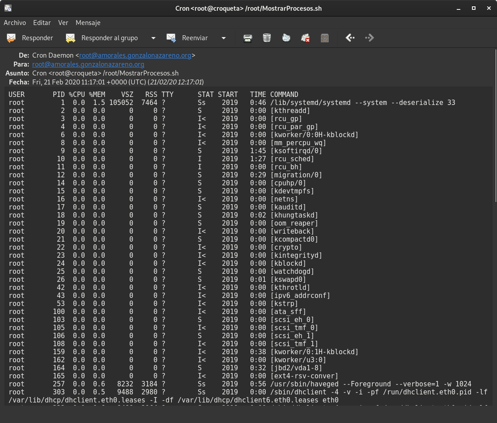

Después tenemos que añadir al fichero `/home/debian/.forward` una linea que sea nuestro correo.
~~~
ale95mogra@gmail.com
~~~

Comprobamos que nos llega al servidor de Gmail.

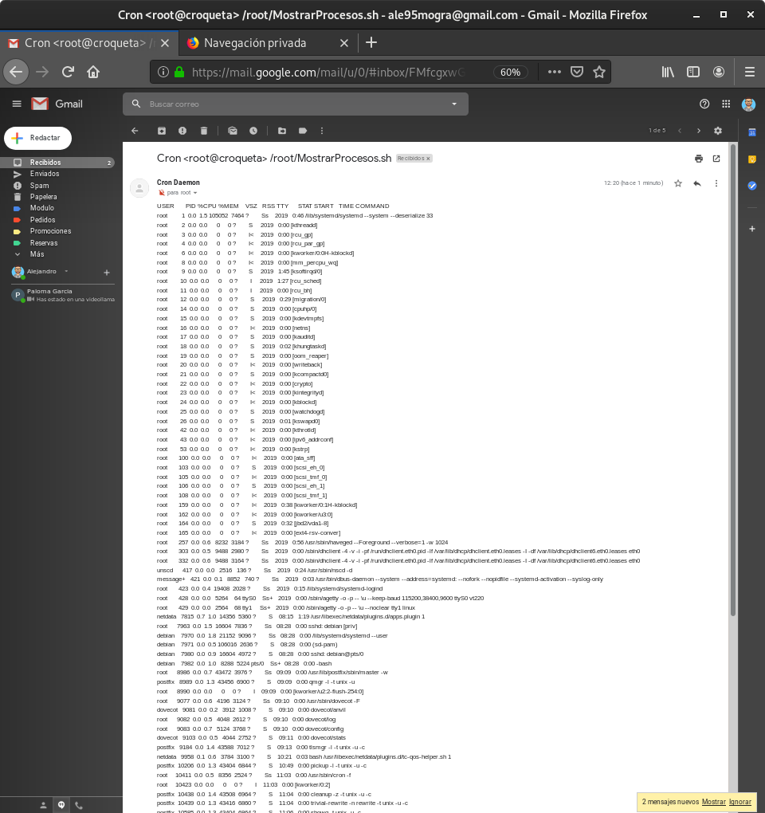